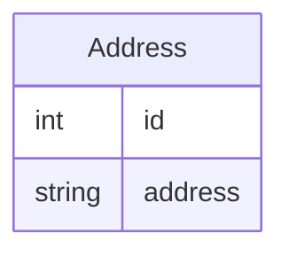

# Address Book API using FastAPI (Python):

This is the solution for one of my assignments.

## Models:

At the time of writing this, the API has one model which would be address.




## Database:

SQLite is being used for database. SQLAlchemy is the library name in python that helps us in making this database in python.

## CRUD Operation

### 1- Create 
### function to create a address model
```
def create_address(db:Session, address):
    new_address = addressBook(address=address)
    db.add(new_address)
    db.commit()
    db.refresh(new_address)
    return new_address
```

### 2- Read
### get the first record with a given id, if no such record exists, will return null
   ``` 
    def get_address(db:Session, id:int):
    db_addresbook = db.query(addressBook).filter(addressBook.id==id).first()
    return db_addresbook
    
```

### 3- Update
### Update a address object's attributes
    
```
def update_address(db:Session, id:int, address: str):
    
    db_address = get_address(db=db, id=id)
    db_address.address = address

    db.commit()
    db.refresh(db_address)
    return db_address
```

### 4- Delete
###  Delete a address object
```
def delete_address(db:Session, id:int):
   
    db_address = get_address(db=db, id=id)
    db.delete(db_address)
    db.commit()
```

### How to run
```
uvicorn app.main:app --reload

http://localhost:8000/docs

```
